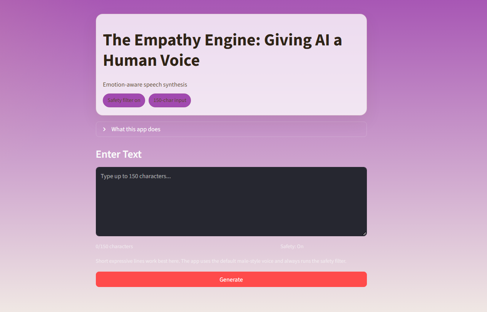
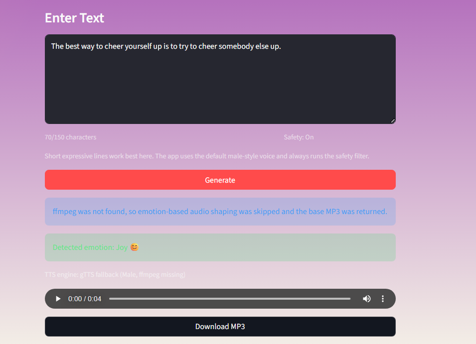

# Affective TTS

A lightweight web app for emotion-aware text to speech on small hardware. It analyzes short text, blocks unsafe input, generates a base voice with `gTTS`, and reshapes the audio with `pydub` so the output better matches the detected emotion.

## UI Preview

Drop your screenshots into `docs/images/` and then uncomment or replace the sample blocks below.

Suggested filenames:

- 
- 


## Highlights

- Lightweight safety screening with `alt-profanity-check` plus regex backstops.
- Distilled emotion classification with `bhadresh-savani/distilbert-base-uncased-emotion`.
- Low-cost audio generation with `gTTS`.
- Emotion-aware pitch, speed, and gain shaping with `pydub`.
- Short-input flow tuned for low-memory environments.
- Audio playback plus downloadable output from the browser UI.

## How It Works

### 1. Safety check

Input is screened before synthesis. The app combines a small profanity model with a few targeted regex rules for sexual content and self-harm or threat language. If the text is flagged, generation stops immediately.

### 2. Emotion detection

Emotion analysis uses a distilled transformer model:

- `bhadresh-savani/distilbert-base-uncased-emotion`

This keeps inference lighter than larger encoder models and is better suited to constrained environments.

### 3. Emotion mapping

The model output is normalized into the app’s UI emotion categories:

- `joy`, `love` -> `Joy`
- `sadness` -> `Sadness`
- `anger` -> `Anger`
- `fear` -> `Fear`
- `surprise` -> `Surprise`
- low-confidence predictions -> `Confusion`

`Disgust` is inferred only in low-confidence anger-heavy cases.

### 4. Voice generation

The app creates a base MP3 with `gTTS`, then applies lightweight audio shaping:

- `Joy` or `Surprise`: faster and brighter
- `Sadness` or `Fear`: slower and lower
- `Anger` or `Disgust`: faster, louder, and sharper
- `Confusion`: slightly slower with a mild pitch lift

If `ffmpeg` or `ffprobe` is unavailable, the app falls back to the raw MP3 output instead of crashing.

## Project Structure

```text
text-speech/
├── app.py
├── .env.example
├── packages.txt
├── README.md
├── requirements.txt
├── docs/
│   └── images/
└── src/
    └── affective_tts/
        ├── __init__.py
        ├── config.py
        ├── emotion.py
        ├── safety.py
        └── tts.py
```

## Local Setup

### 1. Create and activate a virtual environment

```powershell
python -m venv .venv
.venv\Scripts\Activate.ps1
```

### 2. Install dependencies

```powershell
pip install -r requirements.txt
```

### 3. Create a local `.env` file

Copy `.env.example` to `.env` and adjust values if needed:

```dotenv
EMOTION_MODEL_NAME=bhadresh-savani/distilbert-base-uncased-emotion
GTTS_MALE_TLD=co.uk
GTTS_FEMALE_TLD=com.au
PROFANITY_THRESHOLD=0.65
FFMPEG_BINARY=
FFPROBE_BINARY=
```

### 4. Launch the app

Use `app.py` as the entry point in your local Python environment.

## Configuration

The app loads `.env` automatically via `python-dotenv`.

Available settings:

- `EMOTION_MODEL_NAME`: defaults to `bhadresh-savani/distilbert-base-uncased-emotion`
- `GTTS_MALE_TLD`: defaults to `co.uk`
- `GTTS_FEMALE_TLD`: defaults to `com.au`
- `PROFANITY_THRESHOLD`: defaults to `0.65`
- `FFMPEG_BINARY`: optional absolute path to `ffmpeg.exe`
- `FFPROBE_BINARY`: optional absolute path to `ffprobe.exe`

## Deployment Notes

- Keep inputs short for the best performance.
- Install Python packages from `requirements.txt`.
- Install `ffmpeg` through `packages.txt` in environments that support system packages.
- If `ffmpeg` is not on `PATH` on Windows, set `FFMPEG_BINARY` and `FFPROBE_BINARY` in `.env`.

## Why This Version Is Lightweight

- No local TTS model is loaded into RAM.
- `gTTS` handles base speech generation remotely.
- Emotion analysis uses a distilled classifier instead of a larger encoder.
- Safety relies on a small profanity model and regex checks instead of a heavy moderation stack.

## Future Improvements

- Cache generated audio for repeated prompts.
- Add screenshot assets and a richer preview section in this README.
- Add a regex-only safety fallback if the profanity package fails to load.
